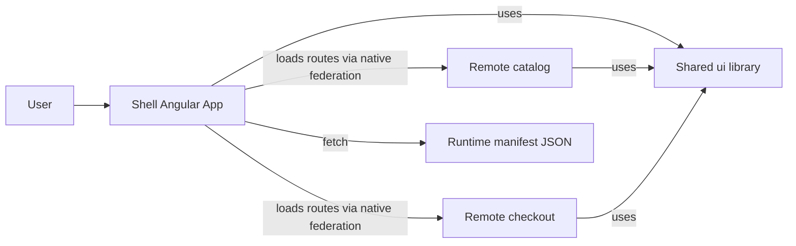

# Step 3 — Hands-on target architecture + contracts (CSR, Angular 21, Native Federation)

This is the concrete spec we’ll implement next (in 💻 Code mode).

## 1) Target topology

- **Shell (host)**: `shell`
- **Remotes**: `catalog`, `checkout`
- **Shared library**: `ui` (design system primitives)

Composition style: **route-level**

Routes:

- Shell mounts `catalog` under `/catalog`
- Shell mounts `checkout` under `/checkout`

## 2) Shell ↔ remote integration contract

### 2.1 What a remote exposes

Each remote exposes a single ESM entry that exports:

- `remoteRoutes` — a typed Angular route subtree

Conceptually:

```ts
// in remote entry
export const remoteRoutes: Routes = [
  {
    path: '',
    providers: [/* remote-scoped providers */],
    children: [
      { path: '', loadComponent: () => import('./pages/home').then(m => m.HomeComponent) },
      { path: 'details/:id', loadComponent: () => import('./pages/details').then(m => m.DetailsComponent) }
    ]
  }
];
```

The contract is deliberately small:

- The shell does **not** reach into remote internals.
- The remote owns its internal routes, guards, resolvers, and providers.

### 2.2 How the shell consumes it

Shell defines its own top-level routes:

- `/catalog` lazy-loads the remote entry, then returns `remoteRoutes`
- `/checkout` similarly

Failure behavior (important in MFEs):

- If loading a remote fails (network, manifest mismatch), shell shows a shell-owned fallback component for that route.
- Fallback displays: remote name + manifest version + a retry action.

## 3) Runtime remote discovery (manifest-driven)

### 3.1 Manifest file

Shell loads a JSON manifest at runtime (no rebuild needed).

Initial learning-friendly schema:

```json
{
  "manifestVersion": 1,
  "generatedAt": "2026-02-13T00:00:00.000Z",
  "remotes": {
    "catalog": {
      "entry": "http://localhost:4201/remoteEntry.js",
      "exposes": {
        "routes": "./routes"
      },
      "version": "0.0.0-local"
    },
    "checkout": {
      "entry": "http://localhost:4202/remoteEntry.js",
      "exposes": {
        "routes": "./routes"
      },
      "version": "0.0.0-local"
    }
  }
}
```

### 3.2 Env switching

We’ll support **dev vs prod** by selecting the manifest URL at runtime.

Simplest scalable approach (supports troubleshooting without rebuilding):

- Default manifest URL: `/assets/mfe.manifest.json`
- Override option 1 (highest precedence): query param `?manifest=/assets/mfe.manifest.dev.json`
- Override option 2: `localStorage` key `mfe:manifestUrl`

Precedence rules:

1. Query param override (if present)
2. `localStorage` override (if present)
3. Default `/assets/mfe.manifest.json`

Rationale: query param is great for “shareable repro URLs”; `localStorage` is convenient for devs who want a sticky override.

### 3.3 Caching + rollback behavior (learning-friendly)

To model real production resilience, the shell will keep a **last-known-good** manifest:

- On successful fetch + minimal schema validation, store the manifest JSON in `localStorage` under `mfe:lastGoodManifest`.
- If fetching the manifest fails, fall back to `mfe:lastGoodManifest` and show a banner/diagnostics.

This gives us a concrete rollback story:

- Delete overrides to return to default manifest
- Or pin a known-good manifest file path via query param

## 4) Shared dependency policy (CSR-focused)

Hard requirement:

- `@angular/*` and `rxjs` must not be duplicated at runtime.

Policy we’ll implement:

- All apps use **Angular 21.x** and aligned versions.
- Native federation configuration shares these as **singletons**:
  - `@angular/core`, `@angular/common`, `@angular/router`
  - `@angular/forms` (if used)
  - `@angular/platform-browser`, `@angular/platform-browser-dynamic`
  - `rxjs`, `tslib`
- The `ui` library is a normal workspace library (compiled once per app build), kept stable and small.

## 5) Cross-cutting concerns boundaries (minimal for learning)

- **Auth**: stub only (we’ll show where it would plug in). Shell is the place that would own auth bootstrapping and token refresh.
- **Design tokens**: CSS variables defined by shell; remotes consume them. `ui` components must rely on tokens rather than hardcoded colors.
- **Communication** (intentionally minimal):
  - URL + router navigation only for the initial learning repo
  - Optional later step: a typed event bridge (DOM CustomEvent) for coarse-grained events

## 6) Diagram


